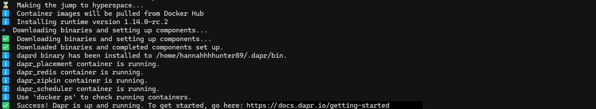
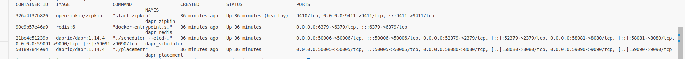

# DAPR

Niniejszy projekt pokazuje wykorzystanie DAPR w komunikacji między różnymi systemami i aplikacjami.

## Instalacja

> ### Wymagania
> - docker

### 1. Pobranie pakietu i instalacja

Instalowana jest ostatnia (najnowsza) wersja Dapr-a.

```bash
wget -q https://raw.githubusercontent.com/dapr/cli/master/install/install.sh -O - | /bin/bash
```

### 2. Weryfikacja instalacji:

Poniższym poleceniem weryfikujemy, czy jest zainstalowany CLI Dapr-a

```bash
dapr -h
```

Jeżeli tak, to powinien pojawić się następujący komunikat:

```bash
         __
    ____/ /___ _____  _____
   / __  / __ '/ __ \/ ___/
  / /_/ / /_/ / /_/ / /
  \__,_/\__,_/ .___/_/
              /_/

===============================
Distributed Application Runtime

Usage:
  dapr [command]

Available Commands:
  completion     Generates shell completion scripts
  components     List all Dapr components. Supported platforms: Kubernetes
  configurations List all Dapr configurations. Supported platforms: Kubernetes
  dashboard      Start Dapr dashboard. Supported platforms: Kubernetes and self-hosted
  help           Help about any command
  init           Install Dapr on supported hosting platforms. Supported platforms: Kubernetes and self-hosted
  invoke         Invoke a method on a given Dapr application. Supported platforms: Self-hosted
  list           List all Dapr instances. Supported platforms: Kubernetes and self-hosted
  logs           Get Dapr sidecar logs for an application. Supported platforms: Kubernetes
  mtls           Check if mTLS is enabled. Supported platforms: Kubernetes
  publish        Publish a pub-sub event. Supported platforms: Self-hosted
  run            Run Dapr and (optionally) your application side by side. Supported platforms: Self-hosted
  status         Show the health status of Dapr services. Supported platforms: Kubernetes
  stop           Stop Dapr instances and their associated apps. . Supported platforms: Self-hosted
  uninstall      Uninstall Dapr runtime. Supported platforms: Kubernetes and self-hosted
  upgrade        Upgrades a Dapr control plane installation in a cluster. Supported platforms: Kubernetes
  version        Print the Dapr runtime and CLI version

Flags:
  -h, --help      help for dapr
  -v, --version   version for dapr

Use "dapr [command] --help" for more information about a command.
```

## Inicjalizacja Dapr na środowisku lokalnym


Po instalacji Dapr CLI, należy zainicjować Dapr-a na maszynie lokalnej.

Dapr działa jako sidecar obok aplikacji. W trybie self-hosted oznacza to, że jest to proces na lokalnej maszynie. Inicjalizując Dapr, wykonywane są następujące rzeczy:

- Pobierane i instalowane są pliki binarne Dapr sidecar lokalnie.
- Tworzone jest środowisko deweloperskie, które usprawnia rozwój aplikacji z Dapr.

Inicjalizacja Dapr obejmuje:

- Uruchomienie instancji kontenera Redis, który będzie używany jako lokalny magazyn stanów i broker wiadomości.
- Uruchomienie instancji kontenera Zipkin dla obserwowalności.
- Utworzenie domyślnego folderu z komponentami, zawierającego definicje komponentów dla powyższych.
- Uruchomienie instancji usługi Dapr placement service dla wsparcia lokalnych aktorów.
- Uruchomienie instancji usługi Dapr scheduler service dla harmonogramowania zadań.

Inicjalizacja Dapr-a zakłada, ze na komputerze lokalnie jest zainstalowany Docker.

### 1. Inicjalizacja

```sh
sudo dapr init
```


### 2. Weryfikacja wersji Dapr-a
```sh
sudo dapr --version
```
Oczekiwane wyjście:

> CLI version: 1.14.1 <br>
> Runtime version: 1.14.4

### 3. Weryfikacja uruchomionych kontenerów

W konsoli należy wykonać polecenie:
```bash
sudo docker ps
```
Powinna pojawić się lista kontenerów:


#### 4. Weryfikacja zainstalowanych komponentów

Wykonanie polecenia ```dapr init``` tworzy folder komponentów, w ktorym znajdują się definicje w plikach YAML, w tym:
- Przechowywanie stanu (Redis),
- Przetwarzanie wiadomości (Redis),
- Logowania operacji (Zipkin)

Lokalizacja komponentów znajduje się w katalogu: ```~/.dapr```:

```bash
ls $HOME/.dapr
```
Wynik:
> bin components config.yaml